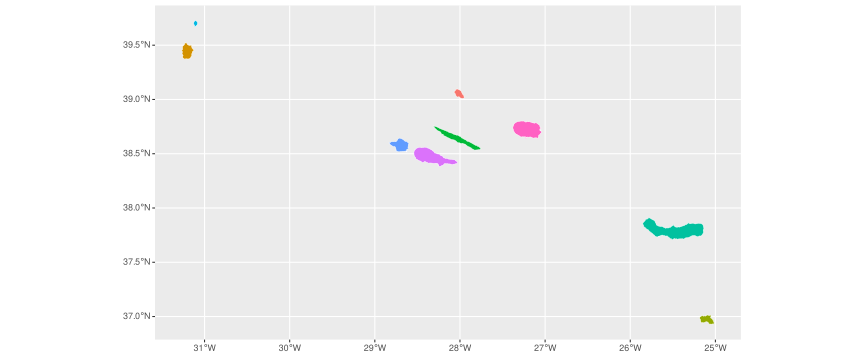
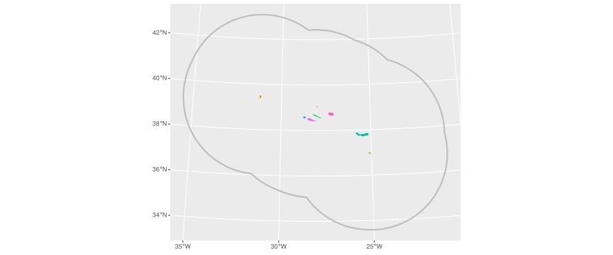
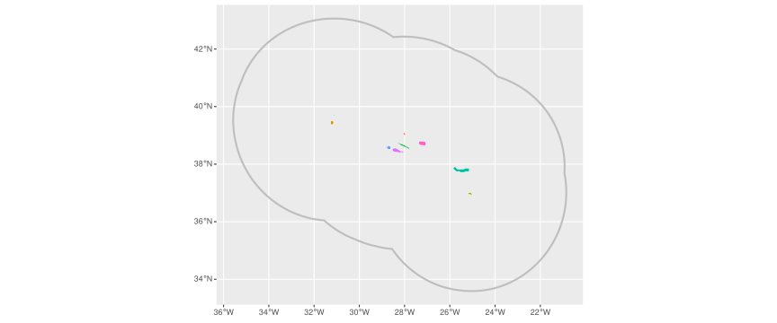

<!-- README.md is generated from README.Rmd. Please edit that file -->

# CAOP.RAA.2024

<!-- badges: start -->
<!-- badges: end -->

The goal of `{CAOP.RAA.2024}` is to provide the official administrative
boundaries of the Azores (Região Autónoma dos Açores (RAA)) as defined
in the 2024 edition of the Carta Administrativa Oficial de Portugal
(CAOP), published by the Direção-Geral do Território (DGT). The package
includes convenience functions to import these boundaries as ‘sf’
objects for spatial analysis in R.

## Installation

``` r
# install.packages("pak")
pak::pak("patterninstitute/CAOP.RAA.2024")
```

## Introduction

Boundary data is provided for districts (islands), municipalities and
civil parishes. Original source for these data has coordinates projected
in UTM 25N for the western group of islands and UTM 26N for the central
and eastern groups. These projections offer the most accurate planar
representation. Use these functions if you want to use these
projections:

- `parishes_25N()` and `parishes_26N()`
- `municipalities_25N()` and `municipalities_26N()`
- `districts_25N()` and `districts_26N()`

Although those functions offer the most accurate projection, they can’t
be combined into one single sf object, as this requires the same CRS for
all features. Alternatively, we also offer a default LAEA projection
centered on the Azores which allow all islands data in one single sf
object. For these data, use these functions:

- `parishes()`
- `municipalities()`
- `districts()`

## Data

Districts (islands):

``` r
library(CAOP.RAA.2024)
library(ggplot2)

(districts <- districts())
#> Simple feature collection with 9 features and 6 fields
#> Geometry type: MULTIPOLYGON
#> Dimension:     XY
#> Bounding box:  xmin: -281288.2 ymin: -170294.3 xmax: 266022.8 ymax: 140634.8
#> Projected CRS: +proj=laea +lat_0=38.5 +lon_0=-28 +datum=WGS84 +units=m +no_defs
#>   id            district     area perimeter n_municipalities n_parishes
#> 1 48     Ilha das Flores 14096.22        72                2         11
#> 2 49       Ilha do Corvo  1711.45        21                1          1
#> 3 41 Ilha de Santa Maria  9688.74        78                1          5
#> 4 42  Ilha de São Miguel 74457.50       230                6         64
#> 5 43       Ilha Terceira 40026.72       126                2         30
#> 6 44    Ilha da Graciosa  6065.78        44                1          4
#> 7 45   Ilha de São Jorge 24364.78       139                2         11
#> 8 46        Ilha do Pico 44479.53       153                3         17
#> 9 47       Ilha do Faial 17305.53        80                1         13
#>                         geometry
#> 1 MULTIPOLYGON (((-278363.3 1...
#> 2 MULTIPOLYGON (((-267155.3 1...
#> 3 MULTIPOLYGON (((262934.5 -1...
#> 4 MULTIPOLYGON (((225499.7 -8...
#> 5 MULTIPOLYGON (((67086.26 17...
#> 6 MULTIPOLYGON (((4441.145 57...
#> 7 MULTIPOLYGON (((16402.23 86...
#> 8 MULTIPOLYGON (((-10785.79 -...
#> 9 MULTIPOLYGON (((-57167.91 2...
```

``` r
ggplot(mapping = aes(fill = district)) +
  geom_sf(data = districts, col = "white") +
  guides(fill = "none")
```



Municipalities:

``` r
# municipalities() defaults to municipalities("EPSG:3035").
(mun <- municipalities())
#> Simple feature collection with 19 features and 6 fields
#> Geometry type: MULTIPOLYGON
#> Dimension:     XY
#> Bounding box:  xmin: -281288.2 ymin: -170294.3 xmax: 266022.8 ymax: 140634.8
#> Projected CRS: +proj=laea +lat_0=38.5 +lon_0=-28 +datum=WGS84 +units=m +no_defs
#> First 10 features:
#>      id          municipality            district     area perimeter n_parishes
#> 1  4801      Lajes das Flores     Ilha das Flores  7004.79        51          7
#> 2  4802 Santa Cruz das Flores     Ilha das Flores  7091.44        52          4
#> 3  4901                 Corvo       Ilha do Corvo  1711.45        21          1
#> 4  4101         Vila do Porto Ilha de Santa Maria  9688.74        78          5
#> 5  4201                 Lagoa  Ilha de São Miguel  4559.32        45          5
#> 6  4202              Nordeste  Ilha de São Miguel 10146.80        53          9
#> 7  4203         Ponta Delgada  Ilha de São Miguel 23298.65       102         24
#> 8  4204              Povoação  Ilha de São Miguel 10640.77        64          6
#> 9  4205        Ribeira Grande  Ilha de São Miguel 18015.13       120         14
#> 10 4206  Vila Franca do Campo  Ilha de São Miguel  7796.82        58          6
#>                          geometry
#> 1  MULTIPOLYGON (((-278354.8 1...
#> 2  MULTIPOLYGON (((-270941.6 1...
#> 3  MULTIPOLYGON (((-267155.3 1...
#> 4  MULTIPOLYGON (((262934.5 -1...
#> 5  MULTIPOLYGON (((221802.1 -8...
#> 6  MULTIPOLYGON (((251756.7 -7...
#> 7  MULTIPOLYGON (((202982.7 -8...
#> 8  MULTIPOLYGON (((234835.9 -8...
#> 9  MULTIPOLYGON (((219803.1 -7...
#> 10 MULTIPOLYGON (((225482.7 -8...
```

``` r
ggplot(mapping = aes(fill = municipality)) +
  geom_sf(data = mun, col = "white") +
  guides(fill = "none")
```


Parishes of the São Miguel island:

``` r
(parishes <- parishes())
#> Simple feature collection with 156 features and 6 fields
#> Geometry type: MULTIPOLYGON
#> Dimension:     XY
#> Bounding box:  xmin: -281288.2 ymin: -170294.3 xmax: 266022.8 ymax: 140634.8
#> Projected CRS: +proj=laea +lat_0=38.5 +lon_0=-28 +datum=WGS84 +units=m +no_defs
#> First 10 features:
#>        id                parish          municipality        district    area
#> 1  480107              Mosteiro      Lajes das Flores Ilha das Flores  599.39
#> 2  480102             Fajãzinha      Lajes das Flores Ilha das Flores  615.56
#> 3  490101                 Corvo                 Corvo   Ilha do Corvo 1711.45
#> 4  480204 Santa Cruz das Flores Santa Cruz das Flores Ilha das Flores 3967.96
#> 5  480201               Caveira Santa Cruz das Flores Ilha das Flores  328.48
#> 6  480203         Ponta Delgada Santa Cruz das Flores Ilha das Flores 1765.18
#> 7  480202                Cedros Santa Cruz das Flores Ilha das Flores 1029.82
#> 8  480106                 Lomba      Lajes das Flores Ilha das Flores  987.43
#> 9  480105      Lajes das Flores      Lajes das Flores Ilha das Flores 1879.13
#> 10 480103               Fazenda      Lajes das Flores Ilha das Flores  947.36
#>    perimeter                       geometry
#> 1         12 MULTIPOLYGON (((-277962.5 1...
#> 2         13 MULTIPOLYGON (((-277707.5 1...
#> 3         21 MULTIPOLYGON (((-267155.3 1...
#> 4         37 MULTIPOLYGON (((-273740.3 1...
#> 5         10 MULTIPOLYGON (((-270883.3 1...
#> 6         25 MULTIPOLYGON (((-275904.3 1...
#> 7         18 MULTIPOLYGON (((-270573.9 1...
#> 8         18 MULTIPOLYGON (((-270883.3 1...
#> 9         24 MULTIPOLYGON (((-273020 102...
#> 10        15 MULTIPOLYGON (((-271975.5 1...
```

``` r
parishes |>
  dplyr::filter(district == "Ilha de São Miguel") |>
  ggplot(mapping = aes(fill = parish)) +
  geom_sf(col = "white") +
  guides(fill = "none")
```


## Exclusive Economic Zone

``` r
# LAEA custom projection
ggplot() +
geom_sf(data = eez(), fill = NA, linewidth = 1, col = "gray") +
geom_sf(data = districts(), mapping = aes(fill = district), col = "white") +
guides(fill = "none")
```



``` r
# WGS 84 projection
ggplot() +
geom_sf(data = eez(crs = "EPSG:4326"), fill = NA, linewidth = 1, col = "gray") +
geom_sf(data = districts(crs = "EPSG:4326"), mapping = aes(fill = district), col = "white") +
guides(fill = "none")
```



## Sources

- [Carta Administrativa Oficial de
  Portugal](https://www.dgterritorio.gov.pt/cartografia/cartografia-tematica/caop)
- [GitHub CAOP](https://github.com/dgterritorio/CAOP)
